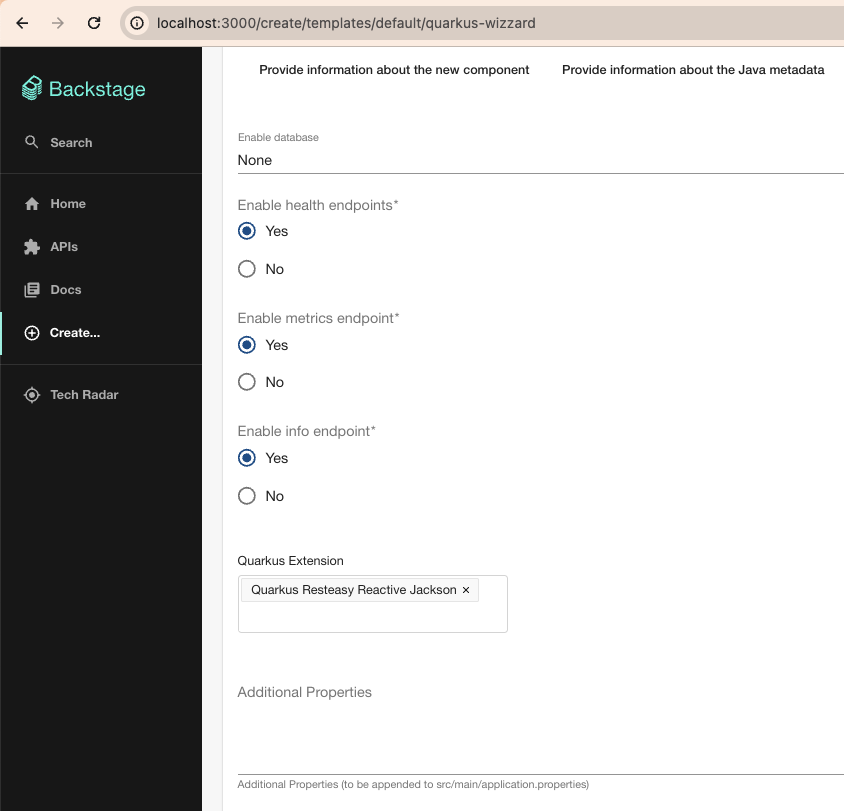
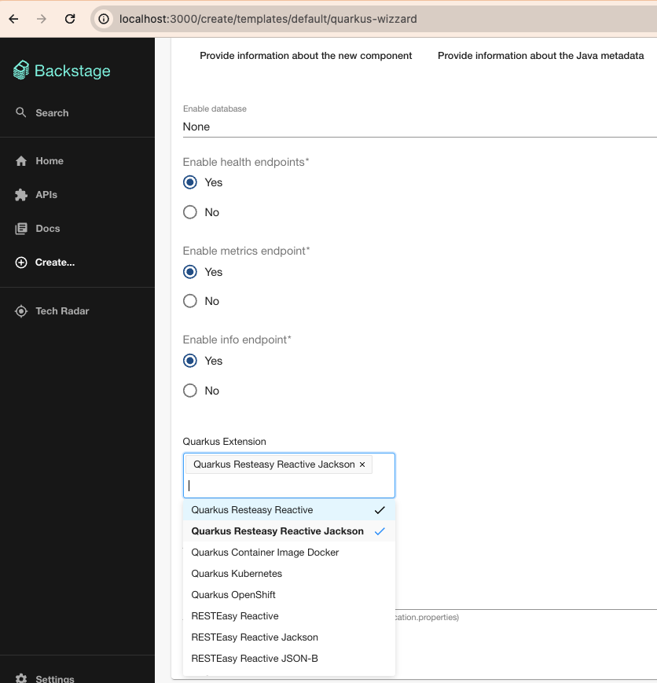
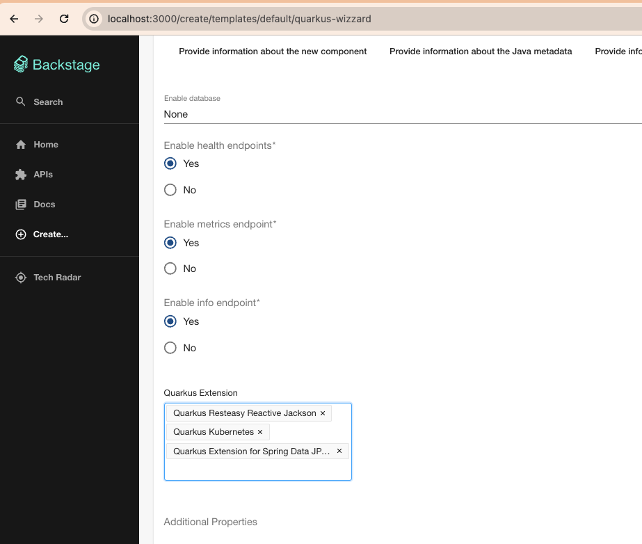
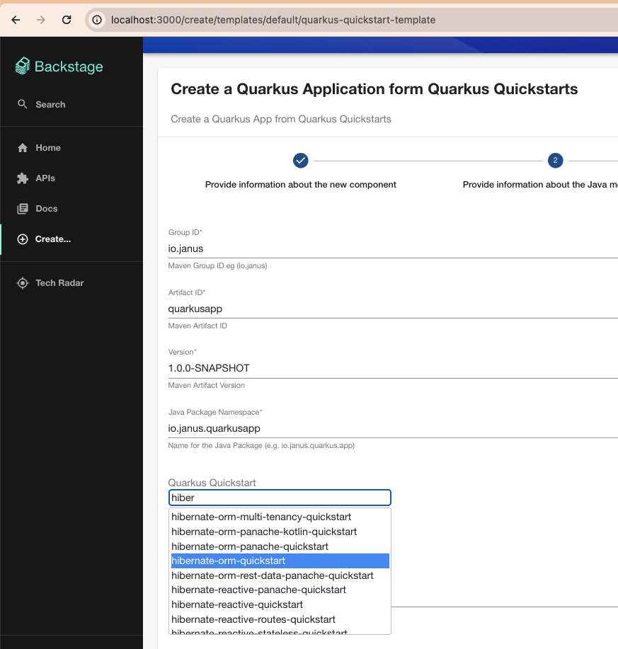
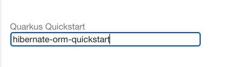

# @qshift/quarkus-plugins

This project contains different [Backstage](https://backstage.io/) plugins to work with [Quarkus](https://quarkus.io/) which is a Kubernetes-native Java framework tailored for GraalVM and HotSpot, crafted from best-of-breed Java libraries and standards.

This repository contains the following Backstage plugins:

- [Quarkus Frontend](#quarkus-frontend)
- [Quarkus Scaffolder Backend](#quarkus-scaffolder-backend)

## Prerequisites

- [Node.js](https://nodejs.org/en) (18 or 20)
- [nvm](https://github.com/nvm-sh/nvm), npm and [yarn](https://classic.yarnpkg.com/lang/en/docs/install/#mac-stable) installed

## Getting started

To play with one of our plugins, create first a [Backstage](https://backstage.io/docs/getting-started/) application locally using this command:
```
npx @backstage/create-app@latest
```

To fix the React issue https://github.com/backstage/backstage/issues/22142 which has been reported using the client `0.25` and backstage (> 1.21),
then edit the `package.json` to add the following dependency:
```json
  "resolutions": {
...
    "swagger-ui-react": "5.10.5"
  },
```

Verify if the newly application created is working fine: `yarn dev`

## Quarkus Frontend

This plugin proposes different features to:

- Filter, select your Quarkus extensions using the `Quarkus Extension List` field in a template.
- Select using the `Quarkus QuickStart Picker` one of the quickstarts available: https://github.com/quarkusio/quarkus-quickstarts in a template
- Show the Quarkus runtime information: cpu, memory, threads, logs as new tab in the `serviceEntityPage`

**NOTE**: Such frontend feature(s) should be used with the quarkus scaffolder backend plugin (described hereafter) in order to get the generated project from https://code.quarkus.io/ as zip file !

### Quarkus console

Before to use the quarkus console, it is needed to install and configure the kubernetes plugin as [documented](https://backstage.io/docs/features/kubernetes/installation).

Import first the following package within an existing backstage application:
```bash
yarn add --cwd packages/app "@qshift/plugin-quarkus-console"
```
Next, customize the `packages/app/src/components/catalog/EntityPage.tsx` to include a new `<EntityLayout.Route...>`:
```typescript jsx
import {
    QuarkusComponentPodsTable,
} from "@qshift/plugin-quarkus-console";
...
const serviceEntityPage = (
  <EntityLayout>
  ...
    <EntityLayout.Route path="/quarkus" title="Quarkus">
      <QuarkusComponentPodsTable />
    </EntityLayout.Route>
```
Start backstage, register a quarkus component and open the Quarkus view.

### Quarkus fields

To use the quarkus fields, import first the needed package within an existing backstage application:
```bash
yarn add --cwd packages/app "@qshift/plugin-quarkus"
```

Next, customize the `packages/app/src/App.tsx` file according to the field that you plan to use

#### Quarkus extensions field

Edit the `packages/app/src/App.tsx` file to add the tag of the `<QuarkusExtensionListField />`
within the tag `<Route path="/create" element={<ScaffolderPage />}>` as described hereafter.

```tsx
...
import { ScaffolderFieldExtensions } from '@backstage/plugin-scaffolder-react';
import { QuarkusExtensionListField } from '@qshift/plugin-quarkus';
...
    <Route path="/create" element={<ScaffolderPage />}>
      <ScaffolderFieldExtensions>
        <QuarkusExtensionListField />
      </ScaffolderFieldExtensions>
...
```

Update the existing `examples/template/template.yaml` file locally to use extension field:
```yaml
apiVersion: scaffolder.backstage.io/v1beta3
kind: Template
metadata:
  name: quarkus-wizzard
  title: Create a Quarkus Application
  description: Create a Quarkus application using code generator "code.quarkus.io"
  tags:
    - quarkus
    - java
spec:
  owner: guests
  type: service

  parameters:
  ...
  - title: Customize the Quarkus application features
    properties:
      extensions:
        title: Quarkus Extensions
        type: array
        description: The list of the quarkus extensions
        ui:field: QuarkusExtensionList
  steps:
  ...
```

**NOTE**: A real example is available [here](./examples/templates/quarkus-extensions/template.yaml)

When done, you will be able to select your extension(s) when you scaffold a new project.

Quarkus Extension List - default (field):


Quarkus Extension List - Select (field):


Quarkus Extension List - Added (field):


It is also possible to filter the extensions (aka restict the list of the extensions to be used):
```yaml
    ui:field: QuarkusExtensionList
    ui:options:
      filter:
        extensions:
          - io.quarkus:quarkus-resteasy-reactive-jackson
          - io.quarkus:quarkus-smallrye-openapi
          - io.quarkus:quarkus-smallrye-graphql
          - io.quarkus:quarkus-hibernate-orm-rest-data-panache
```
If you would like to use a different code generator server, set the following property
```yaml
    ui:field: QuarkusExtensionList
    ui:options:
        codeQuarkusUrl: https://staging.code.quarkus.io
```

#### Quarkus Quickstart picker field

Edit the `packages/app/src/App.tsx` file to add the tag of the `<QuarkusQuickstartPickerField />`
within the `<Route path="/create" element={<ScaffolderPage />}>` as described hereafter.

```tsx
...
import { ScaffolderFieldExtensions } from '@backstage/plugin-scaffolder-react';
import { QuarkusQuickstartPickerField } from '@qshift/plugin-quarkus';
...
    <Route path="/create" element={<ScaffolderPage />}>
      <ScaffolderFieldExtensions>
        <QuarkusQuickstartPickerField />
      </ScaffolderFieldExtensions>
...
```

Update the existing `examples/template/template.yaml` file locally to use extension field:
```yaml
apiVersion: scaffolder.backstage.io/v1beta3
kind: Template
metadata:
  name: quarkus-quickstart
  title: Create a Quarkus Application from a Quickstart
  description: Create a Quarkus Application from one of the Quickstarts you can find on "https://github.com/quarkusio/quarkus-quickstarts"
  tags:
    - quarkus
    - java
spec:
  owner: guests
  type: service

  parameters:
  ...
  - title: Select the Quarkus Quickstart
    properties:
      quickstartName:
        title: Quickstart Name
        type: string
        description: The name of the quickstart to clone
        default: 'hibernate-orm-panache'
        ui:field: QuarkusQuickstartPicker
  steps:
  ...
```

**NOTE**: A real example is available [here](./examples/templates/quarkus-quickstart-picker/template.yaml)

When done, you will be able to create a new Quarkus project from the quickstart selected.

Quarkus Quickstart Picker - default (field):


Quarkus Quickstart Picker - select (field):



## Quarkus Scaffolder Backend

This plugin proposes 2 actions able to:

- Clone a Quarkus "Quickstart" repository. Action: `quarkus:quickstart:clone`
- Create a Quarkus using the website `code.quarkus.io` able to generate a zip file of a Quarkus project and extensions selected (using extension list field). Action: `quarkus:app:create`

To use the scaffolder backend, import the package under the following path:
```bash
cd packages/backend
yarn add "@qshift/plugin-quarkus-backend"
yarn add "@backstage/integration"
```

### quickstart:clone action

To use the Quarkus action able to clone a quarkus quickstart from this [repository](https://github.com/quarkusio/quarkus-quickstarts), then edit the file `packages/backend/src/plugins/scaffolder.ts` to register the action: `cloneQuarkusQuickstart`.

Here is a snippet example of code changed
```typescript
import { ScmIntegrations } from '@backstage/integration';
import {createBuiltinActions, createRouter} from '@backstage/plugin-scaffolder-backend';
import { cloneQuarkusQuickstart } from '@qshift/plugin-quarkus-backend';
...
  const integrations = ScmIntegrations.fromConfig(env.config);

  const builtInActions = createBuiltinActions({
    integrations,
    catalogClient,
    config: env.config,
    reader: env.reader,
  });

  const actions = [...builtInActions, cloneQuarkusQuickstart()];

  return await createRouter({
    actions,
```

The following table details the fields that you can use to use this action:

| Input                | Description                                                     | Type    | Required |
|----------------------|-----------------------------------------------------------------|---------|----------|
| quickstartName       | The name of the quickstart project to be used                   | string  | Yes      |
| groupId              | Maven GroupID                                                   | string  | No       |
| artifactId           | Maven ArtifactID                                                | string  | No       |
| version              | Maven Version                                                   | string  | No       |
| additionalProperties | Quarkus properties                                              | string  | No       |

Example of action:
```yaml
  steps:
    - id: template
      name: Generating the Source Code Component
      action: quarkus:quickstart:clone
      input:
        values:
          groupId: ${{ parameters.groupId }}
          artifactId: ${{ parameters.artifactId }}
          version: ${{ parameters.version }}
          quickstartName: ${{ parameters.quickstartName }}
          additionalProperties: ${{ parameters.additionalProperties }}
```

### app:create action

To use the Quarkus action able to create a quarkus application using `code.quarkus.io`, then edit the file `packages/backend/src/plugins/scaffolder.ts` to register the action: `createQuarkusApp`.

Here is a snippet example of code changed
```typescript
import { ScmIntegrations } from '@backstage/integration';
import {createBuiltinActions, createRouter} from '@backstage/plugin-scaffolder-backend';
import { createQuarkusApp } from '@qshift/plugin-quarkus-backend';
...
  const integrations = ScmIntegrations.fromConfig(env.config);

  const builtInActions = createBuiltinActions({
    integrations,
    catalogClient,
    config: env.config,
    reader: env.reader,
  });

  const actions = [...builtInActions, createQuarkusApp()];

  return await createRouter({
    actions,
```
The following table details the fields that you can use with this action:

| Input                | Description                                                      | Type    | Required |
|----------------------|------------------------------------------------------------------|---------|----------|
| groupId              | Maven GroupID                                                    | string  | No       |
| artifactId           | Maven ArtifactID                                                 | string  | No       |
| version              | Maven Version                                                    | string  | No       |
| buildTool            | Tool to be used to build: 'MAVEN', 'GRADLE', 'GRADLE_KOTLIN_DSL' | string  | No       |
| extensions           | List of the Quarkus extensions                                   | array   | No       |
| javaVersion          | JDK version                                                      | string  | No       |
| starterCode          | Generate for the project some code to start ?                    | boolean | No       |
| targetPath           | Target Path to access the code within the workspace              | string  | No       |
| additionalProperties | Quarkus properties                                               | string  | No       |
| database             | Quarkus backend database (PostgreSQL, etc)                       | string  | No       |
| infoEndpoint         | Has a Quarkus API endpoint ?                                     | boolean | No       |
| healthEndpoint       | Has a Kubernetes Health endpoint ?                               | boolean | No       |
| metricsEndpoint      | Has a Quarkus metrics endpoint ?                                 | boolean | No       |


Example of action:
```yaml
  steps:
    - id: template
      name: Generating the Source Code Component
      action: quarkus:quickstart:clone
      input:
        values:
          groupId: ${{ parameters.groupId }}
          artifactId: ${{ parameters.artifactId }}
          version: ${{ parameters.version }}
          quickstartName: ${{ parameters.quickstartName }}
          additionalProperties: ${{ parameters.additionalProperties }}
```

Enjoy !